# Sample DDoS traffic analysis

## Project description

This one is the repository for the project made for the "Big Data" course in the academic year 2021-2022 by Matteo Castellucci and Nicolas Farabegoli.

This project aims to analyze the dataset realized by the UNSW called "Bot - IoT" which you can find at [this site](https://research.unsw.edu.au/projects/bot-iot-dataset), while its explanation you can read in [this paper](https://www.sciencedirect.com/science/article/abs/pii/S0167739X18327687).
This dataset contains several authentic DDoS attacks on IoT devices mixed with legit traffic. Our goal was to understand the common patterns between the DDoS traffic and the legit traffic to develop a metric that can distinguish between those two types of traffic.
The analysis used the "spark" library to process the 9 GB of data that makes up the DDoS part of the chosen dataset. 
Then, we developed an app using the "spark streaming" library that can ingest records of the dataset and use the developed metric `collect` operationto tell if a given sample of the dataset contains DDoS records or not, as it was sampling them in real-time.

## Queries plan

### Analysis

  1. Percentage of DDoS records over their total number
  2. Most used protocol in DDoS attacks
  3. Most attacked services in DDoS attacks
  4. Most byte traffic by IP compared to DDoS traffic by the same IP
  5. Calculate the distributions of frequencies for packets and bytes in a flow
  6. Durational statistics for all attacks
  7. Packets, bytes, rate, and "byte rate" order statistics and distributions

### Evaluation

  8. Number of true positives, false negatives, true negatives, and false positives given by the developed metric

## Results

### Queries

#### 1 - Percentage of DDoS records over their total number

| Query                                                             | Input size | Duration |
|-------------------------------------------------------------------|------------|----------|
| Percentage of DDoS records over their total number                | 10.6 GB    | 12 s     |
| Percentage of DDoS records over their total number (**coalesce**) | 10.6 GB    | 13 s     |

<div align="center">
  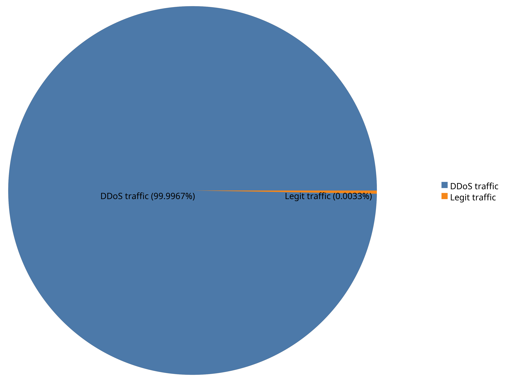
</div>
  
#### 2 - Most used protocol in DDoS attacks

| Query                                             | Input size | Duration |
|---------------------------------------------------|------------|----------|
| Most used protocol in DDoS attacks                | 10.6 GB    | 13 s     |
| Most used protocol in DDoS attacks (**coalesce**) | 10.6 GB    | 14 s     |

<div align="center">
  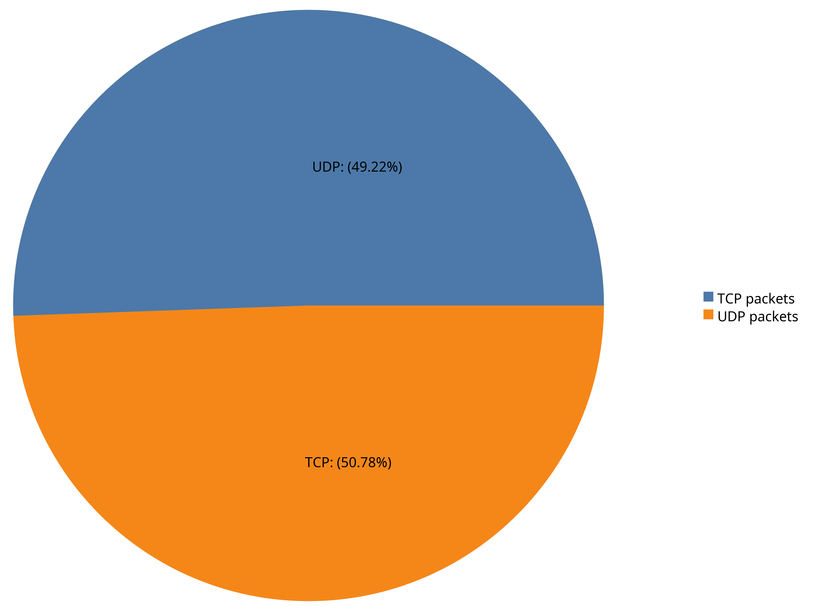
</div>

#### 3 - Most attacked services in DDoS attacks

| Query                                                                                          | Input size | Duration                                      |
|------------------------------------------------------------------------------------------------|------------|-----------------------------------------------|
| Most attacked services in DDoS attacks                                                         | 10.6 GB    | 2 s (20 s with cache writing)                 |
| Most attacked services in DDoS attacks (**broadcast variable**)                                | 10.6 GB    | 1 s (0.3 s for broadcast variable generation) |
| Most attacked services in DDoS attacks (**hash partitioner (12 partitions)**)                  | 10.6 GB    | 1.3 s                                         |
| Most attacked services in DDoS attacks (**hash partitioner on both datasets (12 partitions)**) | 10.6 GB    | 1.1 s                                         |

<div align="center">
  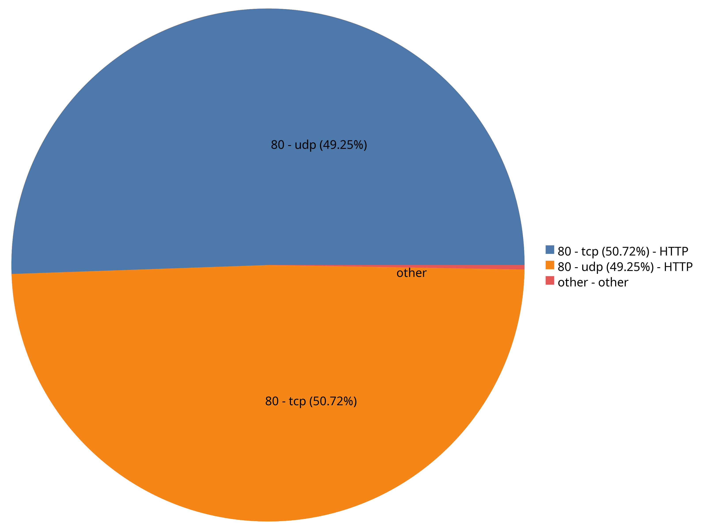
</div>
  
#### 4 - Most byte traffic by IP compared to DDoS traffic by the same IP

| Query                                                        | Input size | Duration                         |
|--------------------------------------------------------------|------------|----------------------------------|
| Byte traffic by IP in DDoS attacks                           | 10.6 GB    | 15 s                             |
| Byte traffic by IP in whole traffic                          | 10.6 GB    | 15 s                             |
| Byte traffic by IP in DDoS attacks (**refactor for cache**)  | 10.6 GB    | 0.7 s (15 s with cache writing)  |
| Byte traffic by IP in whole traffic (**refactor for cache**) | 10.6 GB    | 0.5 s                            |

<div align="center">
  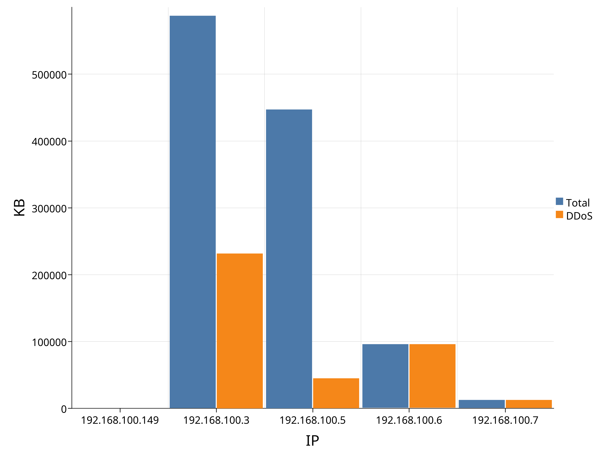
</div>
 
#### 5 - Calculate the distributions of frequencies for packets and bytes in a flow

| Query                                                                                | Input size | Duration                                            |
|--------------------------------------------------------------------------------------|------------|-----------------------------------------------------|
| Count and sum for legit and DDoS packets rate, bytes rate in a flow                  | 10.6 GB    | 26 s (2.2 min with intermediate dataset generation) |
| Standard deviation for legit and DDoS packets rate, bytes rate in a flow             | 10.6 GB    | 26 s                                                |
| Count and sum for legit and DDoS packets rate, bytes rate in a flow (**cache**)      | 10.6 GB    | 0.3 s (2.6 min with cache writing)                  |
| Standard deviation for legit and DDoS packets rate, bytes rate in a flow (**cache**) | 10.6 GB    | 0.5 s                                               |

<div align="center">
  <div>
    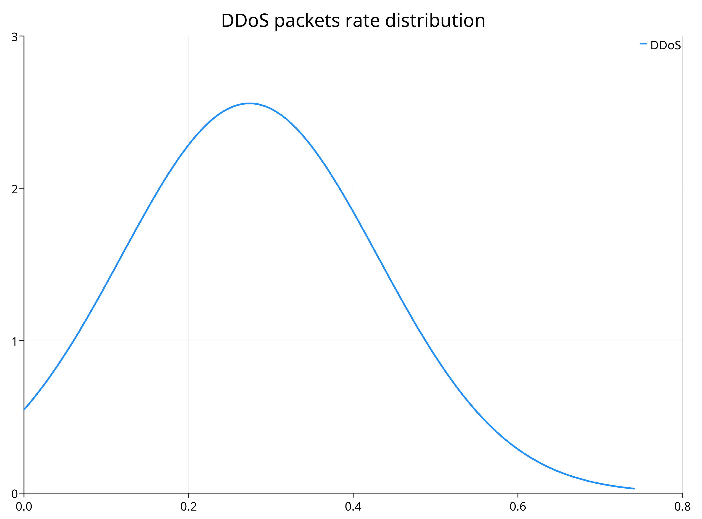
    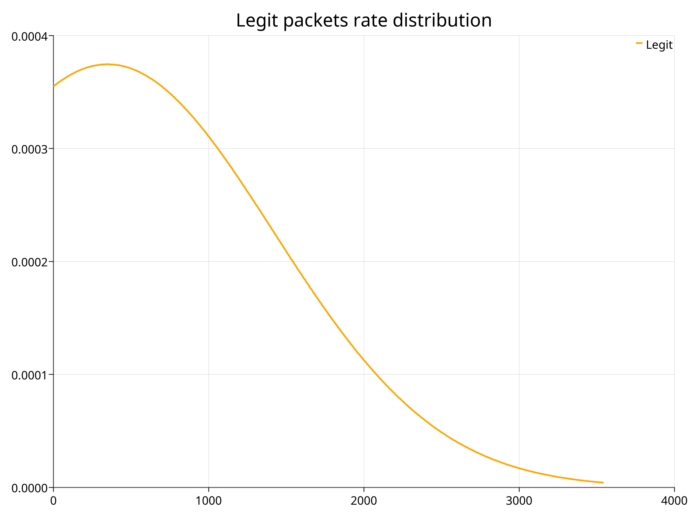
  </div>
  <div>
    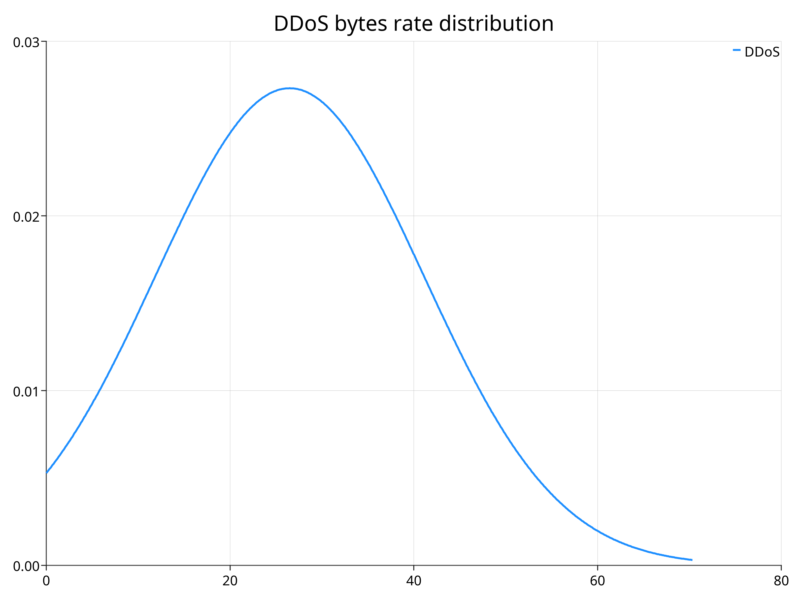
    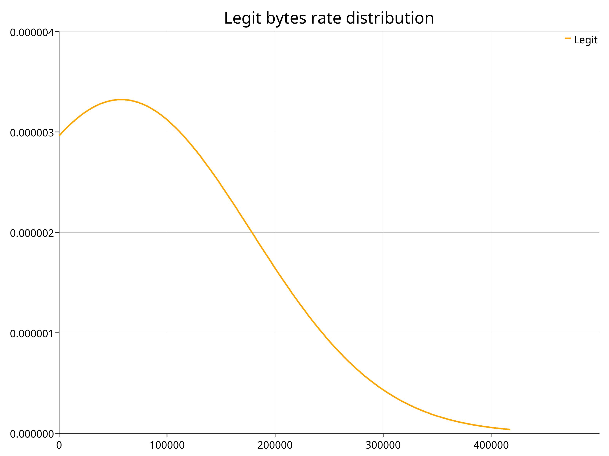
  </div>
</div>

#### 6 - Durational statistics for all attacks

| Query                                                                   | Input size | Duration |
|-------------------------------------------------------------------------|------------|----------|
| Time of first attack beginning and last attack beginning                | 10.6 GB    | 14 s     |
| Time of first attack beginning and last attack beginning (**coalesce**) | 10.6 GB    | 14 s     |

No significative results were found.

#### 7 - Packets, bytes, rate, and "byte rate" order statistics and distributions

| Query                                                             | Input size | Duration                         |
|-------------------------------------------------------------------|------------|----------------------------------|
| Count for DDoS traffic records                                    | 10.6 GB    | 15 s                             |
| Count for legit traffic records                                   | 10.6 GB    | 15 s                             |
| Count for DDoS traffic records without a duration of 0            | 10.6 GB    | 15 s                             |
| Count for legit traffic records without a duration of 0           | 10.6 GB    | 15 s                             |
| Quartiles calculation for DDoS traffic packets                    | 10.6 GB    | 39 s                             |
| Quartiles calculation for legit traffic packets                   | 10.6 GB    | 70 s                             |
| Quartiles calculation for DDoS traffic bytes                      | 10.6 GB    | 41 s                             |
| Quartiles calculation for legit traffic bytes                     | 10.6 GB    | 71 s                             |
| Quartiles calculation for DDoS traffic rate                       | 10.6 GB    | 86 s                             |
| Quartiles calculation for legit traffic rate                      | 10.6 GB    | 67 s                             |
| Quartiles calculation for DDoS traffic bytes rate                 | 10.6 GB    | 99 s                             |
| Quartiles calculation for legit traffic bytes rate                | 10.6 GB    | 67 s                             |
| Distribution calculation for DDoS traffic packets                 | 10.6 GB    | 31 s                             |
| Distribution calculation for legit traffic packets                | 10.6 GB    | 36 s                             |
| Distribution calculation for DDoS traffic bytes                   | 10.6 GB    | 28 s                             |
| Distribution calculation for legit traffic bytes                  | 10.6 GB    | 26 s                             |
| Distribution calculation for DDoS traffic rate                    | 10.6 GB    | 28 s                             |
| Distribution calculation for legit traffic rate                   | 10.6 GB    | 26 s                             |
| Distribution calculation for DDoS traffic bytes rate              | 10.6 GB    | 29 s                             |
| Distribution calculation for legit traffic bytes rate             | 10.6 GB    | 26 s                             |
| Quartiles calculation for DDoS traffic packets (**cache**)        | 10.6 GB    | 11 s (132 s with cache writing)  |
| Quartiles calculation for legit traffic packets (**cache**)       | 10.6 GB    | 0.6 s (39 s with cache writing)  |
| Quartiles calculation for DDoS traffic bytes (**cache**)          | 10.6 GB    | 15 s (75 s with cache writing)   |
| Quartiles calculation for legit traffic bytes (**cache**)         | 10.6 GB    | 0.9 s (0.9 s with cache writing) |
| Quartiles calculation for DDoS traffic rate (**cache**)           | 10.6 GB    | 16 s (65 s with cache writing)   |
| Quartiles calculation for legit traffic rate (**cache**)          | 10.6 GB    | 0.9 s (0.9 s with cache writing) |
| Quartiles calculation for DDoS traffic bytes rate (**cache**)     | 10.6 GB    | 17 s (81 s with cache writing)   |
| Quartiles calculation for legit traffic bytes rate (**cache**)    | 10.6 GB    | 0.7 s (0.7 s with cache writing) |
| Distribution calculation for DDoS traffic packets (**cache**)     | 10.6 GB    | 3 s                              |
| Distribution calculation for legit traffic packets (**cache**)    | 10.6 GB    | 0.5 s                            |
| Distribution calculation for DDoS traffic bytes (**cache**)       | 10.6 GB    | 4 s                              |
| Distribution calculation for legit traffic bytes (**cache**)      | 10.6 GB    | 0.2 s                            |
| Distribution calculation for DDoS traffic rate (**cache**)        | 10.6 GB    | 4 s                              |
| Distribution calculation for legit traffic rate (**cache**)       | 10.6 GB    | 0.3 s                            |
| Distribution calculation for DDoS traffic bytes rate (**cache**)  | 10.6 GB    | 4 s                              |
| Distribution calculation for legit traffic bytes rate (**cache**) | 10.6 GB    | 0.4 s                            |

<div align="center">
  <div>
    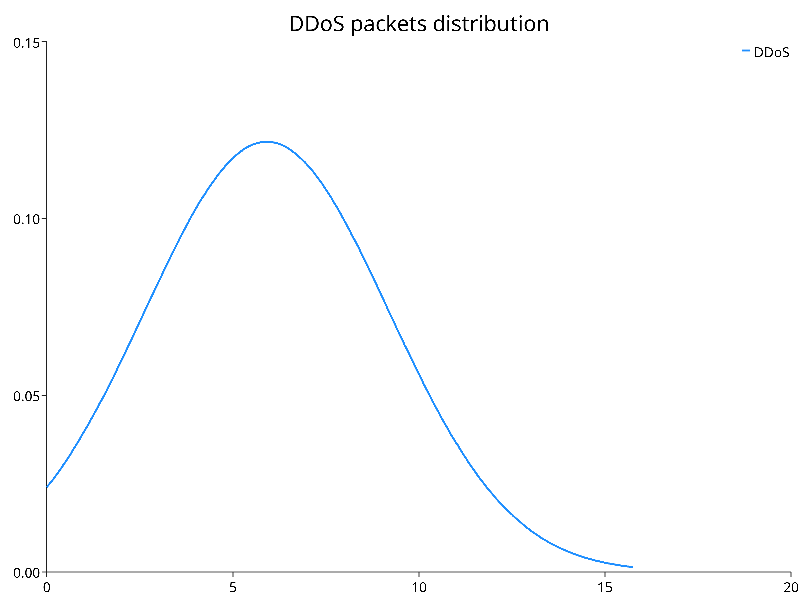
    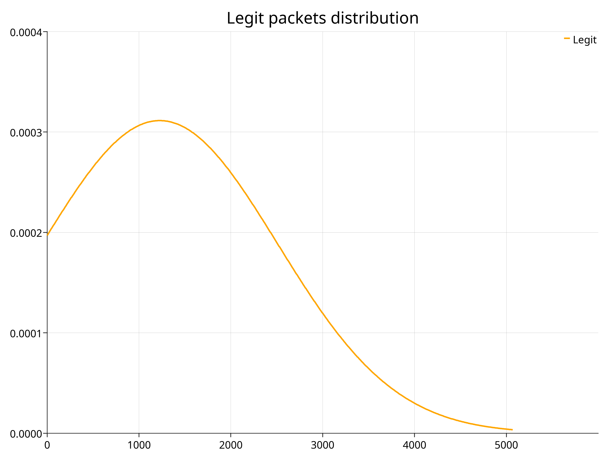
  </div>
  <div>
    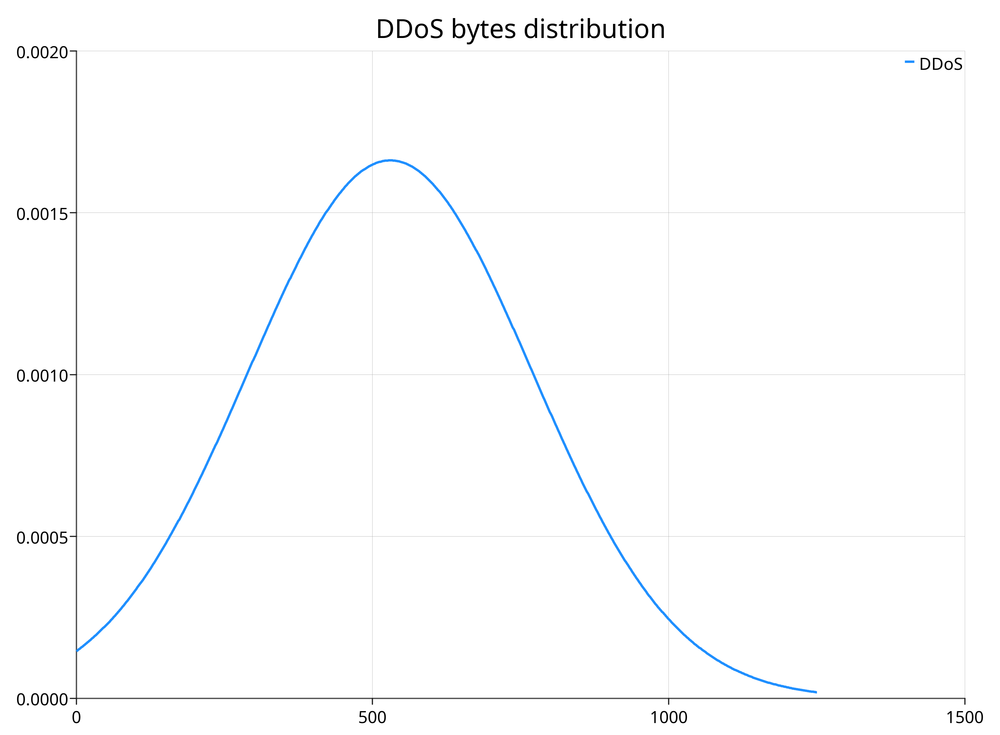
    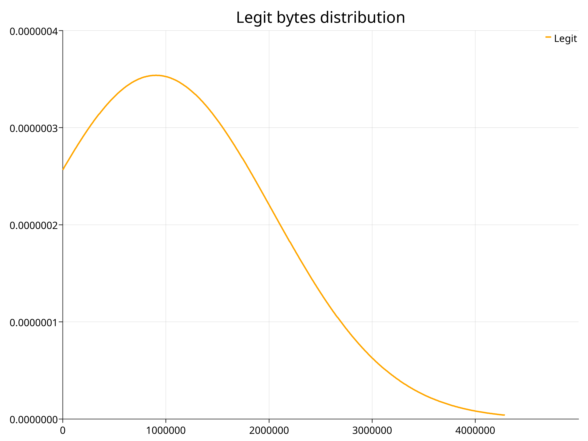
  </div>
  <div>
    
    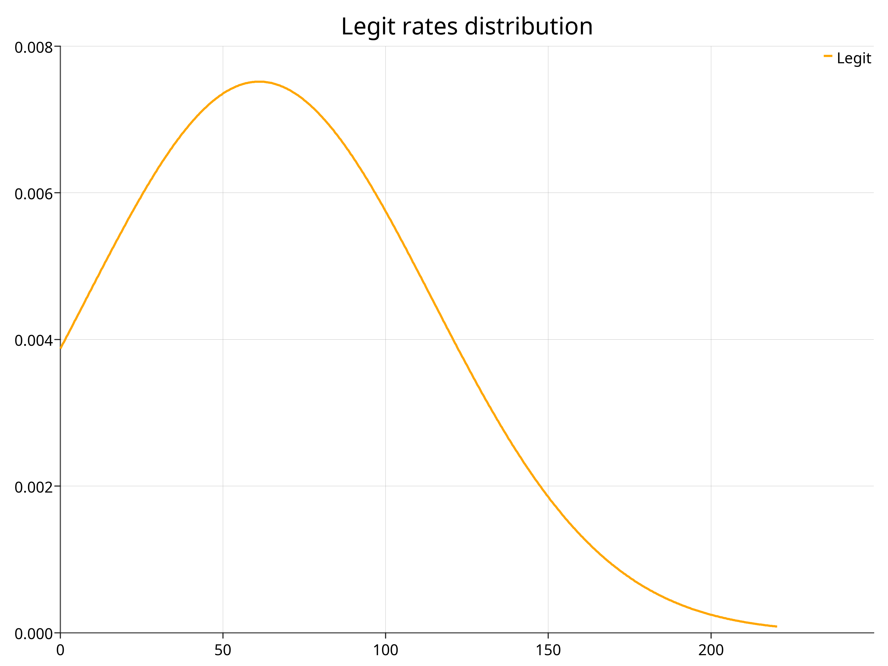
  </div>
  <div>
    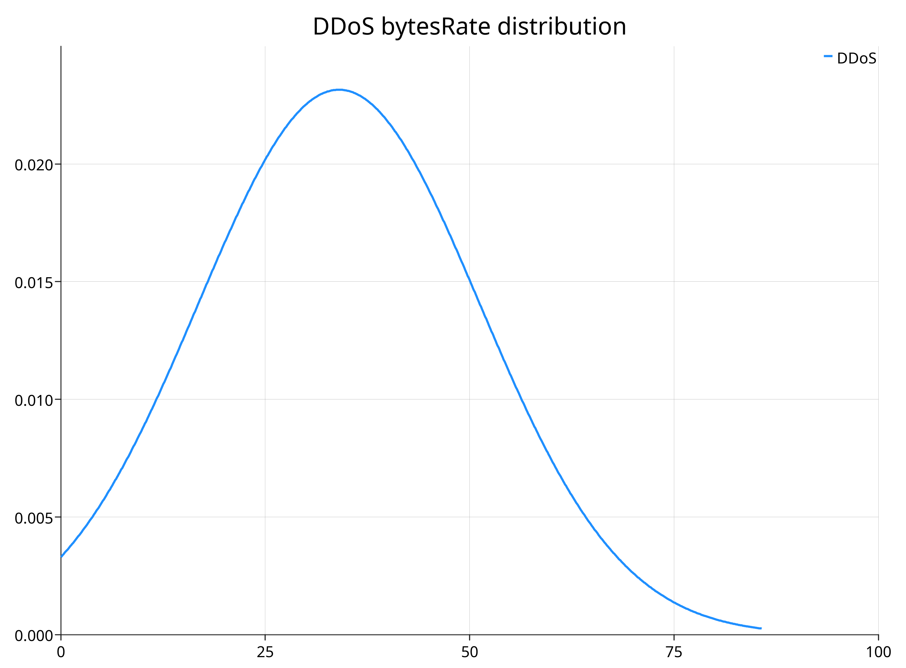
    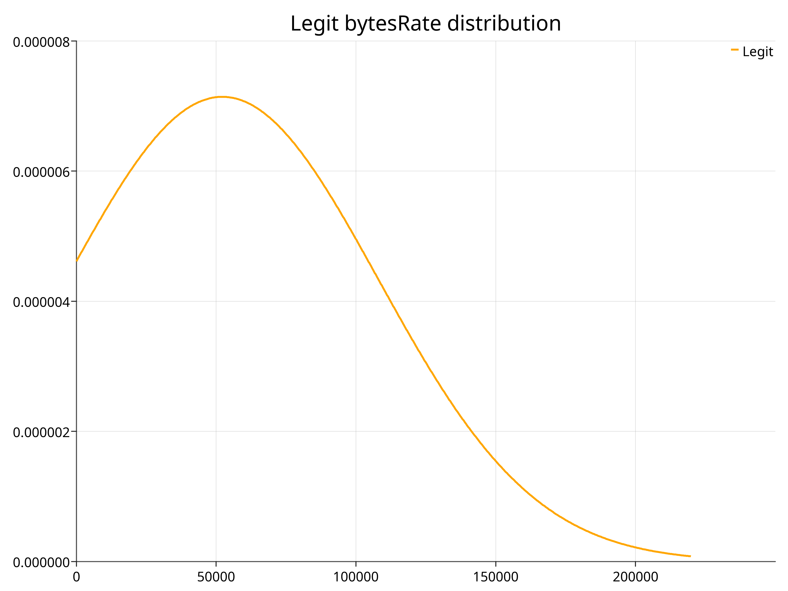
  </div>
</div>

#### 8 - Number of true positives, false negatives, true negatives, and false positives given by the developed metric

| Query                                                                                | Input size | Duration                                        |
|--------------------------------------------------------------------------------------|------------|-------------------------------------------------|
| Confusion matrix calculation                                                         | 11.2 GB    | 2.7 min (4.8 min with cache writing)            |
| Confusion matrix calculation (**broadcast variable**)                                | 11.2 GB    | 1.2 min (8 s for broadcast variable generation) |
| Confusion matrix calculation (**hash partitioner (140 partitions)**)                 | 11.2 GB    | 1.6 min                                         |
| Confusion matrix calculation (**hash partitioner on both datasets (28 partitions)**) | 11.2 GB    | 3.7 min                                         |

|                    | Actually positive | Actually negative |
|--------------------|-------------------|-------------------|
| Predicted positive | 38288961          | 0                 |
| Predicted negative | 241943            | 1259              |


### Metric

```scala
def metric(
    destinationPort: Long, 
    destinationAddress: String, 
    packets: Long, 
    bytes: Long, 
    rate: Double, 
    byteRate: Double, 
    flowRate: Double, 
    flowByteRate: Double
): Double =
    ((if (destinationPort == 80L) 1 else 0) +
     (if (Set("192.168.100.3", "192.168.100.6", "192.168.100.7", "192.168.100.5")(destinationAddress)) 1 else 0) +
     (1 - math.min(math.abs(packets - 5.909105626202674) / (3 * 3.2784993361685184), 1.0)) +
     (1 - math.min(math.abs(bytes - 529.8851801659653) / (3 * 240.0539442965255), 1.0)) +
     (1 - math.min(math.abs(rate - 0.27486262284753876) / (3 * 0.18712897621757338), 1.0)) + 
     (1 - math.min(math.abs(byteRate - 33.86546680087338) / (3 * 17.010164888097375), 1.0)) +
     (1 - math.min(math.abs(flowRate - 0.27403419840566284) / (3 * 0.15597820418003489), 1.0)) +
     (1 - math.min(math.abs(flowByteRate - 26.483191236399332) / (3 * 14.608112880857705), 1.0))
    ) / 8
```

The cut-off for the metric value is 0.5.