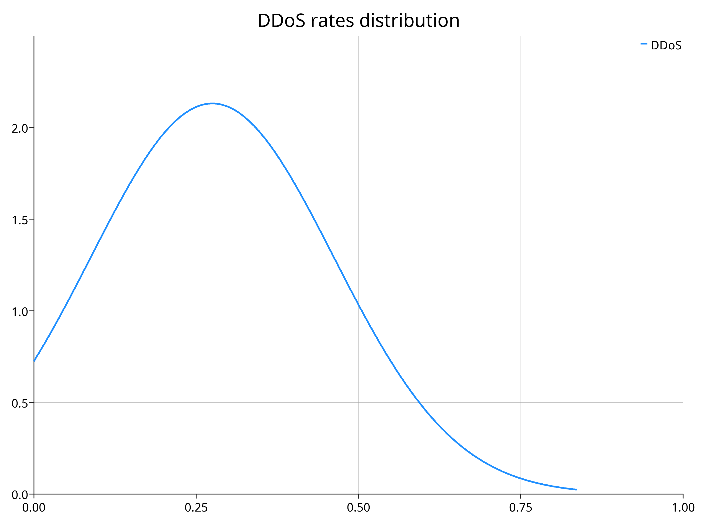

# Sample DDoS traffic analysis

## Project description

This one is the repository for the project made for the "Big Data" course in the academic year 2021-2022 by Matteo Castellucci and Nicolas Farabegoli.

This project aims to analyze the dataset realized by the UNSW called "Bot - IoT" which you can find at [this site](https://research.unsw.edu.au/projects/bot-iot-dataset), while its explanation you can read in [this paper](https://www.sciencedirect.com/science/article/abs/pii/S0167739X18327687).
This dataset contains several authentic DDoS attacks on IoT devices mixed with legit traffic. Our goal was to understand the common patterns between the DDoS traffic and the legit traffic to develop a metric that can distinguish between those two types of traffic.
The analysis used the "spark" library to process the 9 GB of data that makes up the DDoS part of the chosen dataset. 
Then, we developed an app using the "spark streaming" library that can ingest records of the dataset and use the developed metric to tell if a given sample of the dataset contains DDoS records or not, as it was sampling them in real-time.

## Queries plan

### Analysis

  1. Percentage of DDoS records over the total number of them
  2. Most used protocol in DDoS attacks
  3. Most attacked services in DDoS attacks
  4. Most byte traffic by IP compared to DDoS traffic by the same IP
  5. Calculate the distributions of frequencies for packets and bytes in a flow
  6. Temporal statistics for all attacks
  7. Packets, bytes, rate, and "byte rate" order statistics and distributions

### Evaluation

  8. Number of true positives, false negatives, true negatives, and false positives given by the developed metric

## Results

### Queries

#### 1 - Percentage of DDoS records over the total number of them

<div align="center">
  
</div>
  
#### 2 - Most used protocol in DDoS attacks

<div align="center">
  
</div>

#### 3 - Most attacked services in DDoS attacks

<div align="center">
  
</div>
  
#### 4 - Most byte traffic by IP compared to DDoS traffic by the same IP

<div align="center">
  
</div>
 
#### 5 - Calculate the distributions of frequencies for packets and bytes in a flow

<div align="center">
  <div>
    
    
  </div>
  <div>
    
    
  </div>
</div>

#### 6 - Temporal statistics for all attacks

No significative results were found.

#### 7 - Packets, bytes, rate, and "byte rate" order statistics and distributions

<div align="center">
  <div>
    
    
  </div>
  <div>
    
    
  </div>
  <div>
    
    
  </div>
  <div>
    
    
  </div>
</div>

#### 8 - Number of true positives, false negatives, true negatives, and false positives given by the developed metric

|                    | Actually positive | Actually negative |
|--------------------|-------------------|-------------------|
| Predicted positive | 38270702          | 0                 |
| Predicted negative | 260202            | 1259              |


### Metric

```scala
def metric(
    destinationPort: Long, 
    destinationAddress: String, 
    packets: Long, 
    bytes: Long, 
    rate: Double, 
    byteRate: Double, 
    flowRate: Double, 
    flowByteRate: Double
): Double =
    ((if (destinationPort == 80L) 1 else 0) +
     (if (Set("192.168.100.3", "192.168.100.6", "192.168.100.7")(destinationAddress)) 1 else 0) +
     (1 - math.min(math.abs(packets - 5.909105626202674) / (3 * 3.2784993361685184), 1.0)) +
     (1 - math.min(math.abs(bytes - 529.8851801659653) / (3 * 240.0539442965255), 1.0)) +
     (1 - math.min(math.abs(rate - 0.27486262284753876) / (3 * 0.18712897621757338), 1.0)) + 
     (1 - math.min(math.abs(byteRate - 33.86546680087338) / (3 * 17.010164888097375), 1.0)) +
     (1 - math.min(math.abs(flowRate - 0.27403419840566284) / (3 * 0.15597820418003489), 1.0)) +
     (1 - math.min(math.abs(flowByteRate - 26.483191236399332) / (3 * 14.608112880857705), 1.0))
    ) / 8
```

The cut-off for the metric value is 0.5.